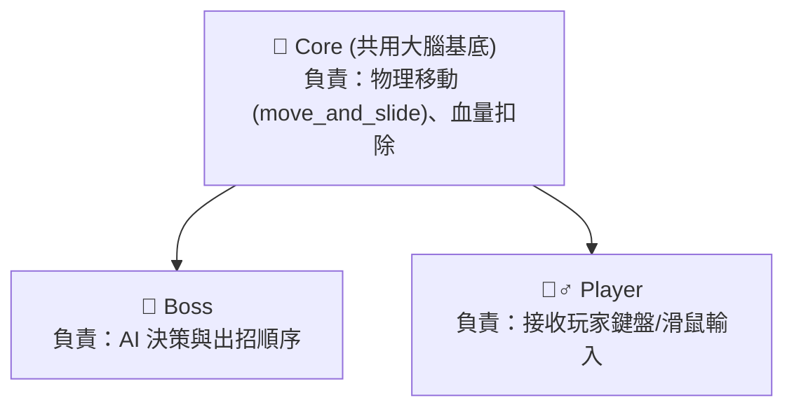
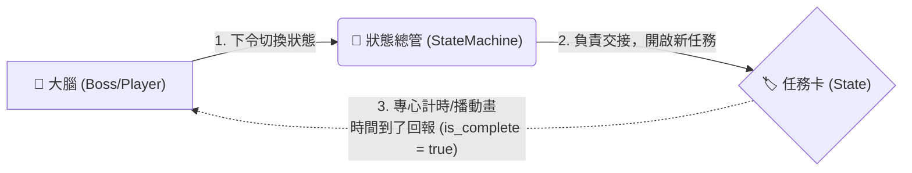

# 🎮 Godot 零基礎 Boss 戰工作坊

**開發引擎：Godot Engine 4.6.1**

這是一個專為程式初學者打造的 Godot 2D 專案模板。
本專案將帶領大家從零開始，透過「階層式狀態機 (HSM)」理解遊戲 AI 的運作邏輯，並親手打造一場 Boss 戰。

---

## 📁 資料夾擺放格式 (專案導覽)

專案目錄經過權限與職責切割，確保開發過程安全防呆，明確區分「底層邏輯」與「可編輯區」：

```text
res://
 ├── Resources/     (放置圖片、音效等美術資源)
 ├── Scenes/        (放置場景檔，例如 Boss.tscn, Main.tscn)
 ├── Scripts/
 │    ├── FSM/      (🛡️ 核心底層區：系統運作基底，請勿修改此處的腳本)
 │    │    ├── State.gd
 │    │    └── StateMachine.gd
 │    └── Boss/     (⚔️ 專案開發區：新增的狀態與招式腳本皆放置於此)
 │         ├── IdleState.gd
 │         └── DashState.gd
 └── Tools/         (放置開發者工具，例如 ExportProject.gd)

```

---

## 🧠 程式架構與物件關係

為了減少重複的程式碼並保護底層引擎架構，本專案嚴格遵守模組化設計原則。

### 1. 物件繼承關係 (基礎類別)

Boss 與 Player 皆共用同一個「大腦基底 (Core)」。這樣的設計讓 Boss 只需要專心處理 AI 判斷，Player 只需要專心處理玩家輸入，無需重複撰寫複雜的血量計算與基礎底層邏輯。



### 2. 狀態溝通機制 (狀態切換迴圈)

大腦（Boss/Player）與狀態卡（State）之間的溝通，就像一個精密的接力賽：



* 🧠 **大腦 (Boss/Player)**：負責思考與決策。當它發現目前的任務完成了（`is_complete == true`），就會決定下一個要切換到什麼狀態。
* 👮 **狀態總管 (StateMachine)**：一個不掛載於場景上的輕量純類別。它不處理物理，只負責執行狀態的交接（幫舊狀態收尾，幫新狀態開局）。
* 🏷️ **任務卡 (State)**：掛載於場景上的實體節點（例如 `DashState.gd`）。負責計時、播放動畫，時間到了就標記自己完成並將控制權還給大腦。
* **對於 Player**：玩家的物理移動主要由 Player 大腦統一處理，State 僅作為切換動畫與記錄狀態的標籤（通常直接使用 `CommonState` 即可）。
* **對於 Boss**：非常鼓勵**直接在 State 腳本內部**，透過存取 `core` 變數來操作實體的物理位移與邏輯。這樣可以讓「哪個狀態對應哪些操作」變得極度直觀且易於管理。


### 3. 🚀 進階用法：階層式狀態機 (HSM)

本專案不僅是普通的扁平狀態機，更支援強大的「巢狀狀態 (Nested States)」。這意味著可以在一個大狀態中，去呼叫與管理多個子狀態。

* **實戰範例**：可以建立一個「巡邏模式 (`PatrolState`)」，並在該腳本內部調用其他現成的狀態，例如交替呼叫「發呆 (`IdleState`)」與「走路 (`WalkState`)」。透過這種「狀態包含狀態」的方式，能夠像組合積木一樣，輕鬆建構出極具深度與變化性的 Boss AI 行為樹！

> **💡 開發指南**
> 透過這種設計，在編寫 Boss 的新招式時，只需專注於該任務卡內的行為邏輯與「什麼時候算完成 (`is_complete = true`)」的條件，完全不需要擔心會與其他招式的程式碼產生衝突！

---

## 🛠️ 開發者專屬工具 (AI 協作)

為了提升除錯與後續開發的效率，專案在 `Tools/` 資料夾下內建了一個輔助腳本：`ExportProject.gd`。

* **如何使用**：這是一個可以直接在編輯器內執行的 `EditorScript`。只需在腳本編輯器中開啟它，然後點擊上方選單的 **File -> Run** (或快捷鍵 `Ctrl+Shift+X`) 即可執行。
* **強大功能**：執行後，它會自動掃描整個專案，將所有的程式碼與 Scenes 節點架構完美整理並匯出成一份 `project_export_for_ai.txt` 純文字檔。
* **應用場景**：你可以直接將這份文字檔提供給 AI（如 Gemini、ChatGPT、Claude），讓 AI 瞬間獲得該專案的「上帝視角」，快速了解專案目前的架構與狀態，從而給出最精準的程式碼擴充或除錯建議！
